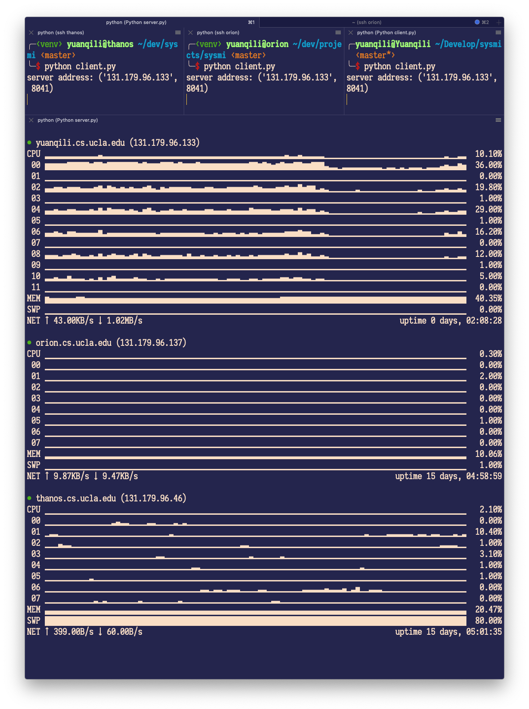

# Sysmi - Cluster usage monitor

Sysmi is a system usage monitor of a multiple of machines.

## Usage

- Configuring `.env` so your clients know where is the master
- Running `client.py` on your clients
- Running `server.py` on your master machine

For example,

```sh
# On machine 1
> python client.py

# On machine 2
> python client.py

# On master
> python server.py
```

## Snapshots

 
 